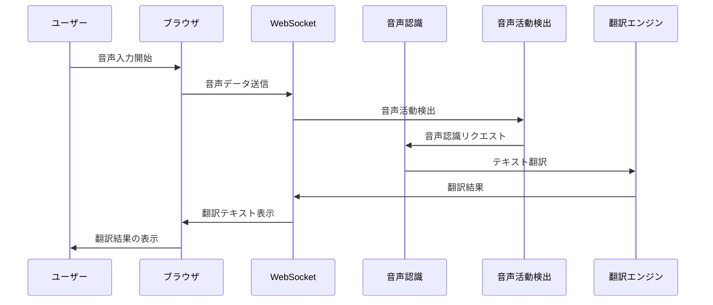

# リアルタイム日英翻訳ウェブアプリ

ローカル環境で動作する日英双方向リアルタイム音声翻訳ウェブアプリケーション

## 機能

- リアルタイム音声認識（ASR）
- 日英双方向翻訳
- 音声活動検出（VAD）
- Webインターフェース
- WebSocketによるリアルタイム通信
- オフライン動作
- Dockerコンテナ対応

## システム要件

### 最低要件
- CPU: 4コア/8スレッド
- RAM: 8GB
- ストレージ: 5GB

### 推奨要件（CPU）
- CPU: 8コア/16スレッド
- RAM: 16GB
- ストレージ: 15GB

### 推奨要件（GPU）
- CPU: 8コア/16スレッド
- RAM: 32GB
- GPU: RTX 4070 8GB / Apple M3 Max 38C
- ストレージ: 30GB

## システムアーキテクチャ



## インストール

### Dockerイメージを使用する場合（推奨）

```bash
# Dockerイメージのプル
docker pull terisuke/local-translator:latest

# 環境変数ファイルの作成
cp .env.example .env

# Hugging Face APIトークンの設定
# https://huggingface.co/settings/tokens からトークンを取得
echo "HUGGING_FACE_HUB_TOKEN=your_token_here" >> .env

# Dockerコンテナの実行
docker run --env-file .env -p 8000:8000 terisuke/local-translator:latest
```

ブラウザで http://localhost:8000 にアクセスしてアプリケーションを使用できます。

### 環境変数の設定

```bash
# .envファイルを作成
cp .env.example .env

# Hugging Face APIトークンを設定
# https://huggingface.co/settings/tokens からトークンを取得
echo "HUGGING_FACE_HUB_TOKEN=your_token_here" >> .env
```

### 直接インストールする場合

```bash
# リポジトリのクローン
git clone https://github.com/terisuke/local_translator.git
cd local_translator

# 仮想環境の作成と有効化
python -m venv .venv
source .venv/bin/activate  # Windows: .venv\Scripts\activate

# 依存関係のインストール
pip install -r requirements.txt

# アプリケーションの起動
uvicorn app:app --host 0.0.0.0 --port 8000
```

## 技術スタック

- **音声認識**: Faster Whisper + Silero VAD
- **機械翻訳**: Hugging Face Transformers (NLLB-200)
- **バックエンド**: FastAPI + Uvicorn
- **リアルタイム通信**: WebSockets
- **フロントエンド音声処理**: Web Audio API + AudioWorkletNode

## 注意事項

- 初回起動時に必要なモデルが自動的にダウンロードされます
- Hugging Face APIトークンが必要です（モデルのダウンロードに使用）
- 音声認識と翻訳は全てローカルで実行されます

## ライセンス

MIT License    